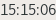
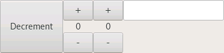
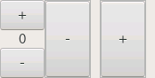

# Relm Example Screenshots

## buttons-attribute

[https://github.com/antoyo/relm/tree/master/examples/buttons-attribute.rs](https://github.com/antoyo/relm/tree/master/examples/buttons-attribute.rs)

## buttons-child-attribute

[https://github.com/antoyo/relm/tree/master/examples/buttons-child-attribute.rs](https://github.com/antoyo/relm/tree/master/examples/buttons-child-attribute.rs)

## buttons-construct-prop-attribute

[https://github.com/antoyo/relm/tree/master/examples/buttons-construct-prop-attribute.rs](https://github.com/antoyo/relm/tree/master/examples/buttons-construct-prop-attribute.rs)

## buttons

[https://github.com/antoyo/relm/tree/master/examples/buttons.rs](https://github.com/antoyo/relm/tree/master/examples/buttons.rs)

## checkboxes

[https://github.com/antoyo/relm/tree/master/examples/checkboxes.rs](https://github.com/antoyo/relm/tree/master/examples/checkboxes.rs)

## child-event

[https://github.com/antoyo/relm/tree/master/examples/child-event.rs](https://github.com/antoyo/relm/tree/master/examples/child-event.rs)

## child-prop-attribute

[https://github.com/antoyo/relm/tree/master/examples/child-prop-attribute.rs](https://github.com/antoyo/relm/tree/master/examples/child-prop-attribute.rs)

## child-prop

[https://github.com/antoyo/relm/tree/master/examples/child-prop.rs](https://github.com/antoyo/relm/tree/master/examples/child-prop.rs)

## clock-attribute

[https://github.com/antoyo/relm/tree/master/examples/clock-attribute.rs](https://github.com/antoyo/relm/tree/master/examples/clock-attribute.rs)

## clock-nightly

[https://github.com/antoyo/relm/tree/master/examples/clock-nightly.rs](https://github.com/antoyo/relm/tree/master/examples/clock-nightly.rs)

## clock

[https://github.com/antoyo/relm/tree/master/examples/clock.rs](https://github.com/antoyo/relm/tree/master/examples/clock.rs)

## communication-attribute

[https://github.com/antoyo/relm/tree/master/examples/communication-attribute.rs](https://github.com/antoyo/relm/tree/master/examples/communication-attribute.rs)

## communication

[https://github.com/antoyo/relm/tree/master/examples/communication.rs](https://github.com/antoyo/relm/tree/master/examples/communication.rs)

## container-attribute

[https://github.com/antoyo/relm/tree/master/examples/container-attribute.rs](https://github.com/antoyo/relm/tree/master/examples/container-attribute.rs)

## container

[https://github.com/antoyo/relm/tree/master/examples/container.rs](https://github.com/antoyo/relm/tree/master/examples/container.rs)

## generic-widget-attribute

[https://github.com/antoyo/relm/tree/master/examples/generic-widget-attribute.rs](https://github.com/antoyo/relm/tree/master/examples/generic-widget-attribute.rs)

## generic-widget

[https://github.com/antoyo/relm/tree/master/examples/generic-widget.rs](https://github.com/antoyo/relm/tree/master/examples/generic-widget.rs)

## include

[https://github.com/antoyo/relm/tree/master/examples/include.rs](https://github.com/antoyo/relm/tree/master/examples/include.rs)

## key-events-attribute

[https://github.com/antoyo/relm/tree/master/examples/key-events-attribute.rs](https://github.com/antoyo/relm/tree/master/examples/key-events-attribute.rs)

## key-events

[https://github.com/antoyo/relm/tree/master/examples/key-events.rs](https://github.com/antoyo/relm/tree/master/examples/key-events.rs)

## model-param-attribute

[https://github.com/antoyo/relm/tree/master/examples/model-param-attribute.rs](https://github.com/antoyo/relm/tree/master/examples/model-param-attribute.rs)

## model-param-widget-attribute

[https://github.com/antoyo/relm/tree/master/examples/model-param-widget-attribute.rs](https://github.com/antoyo/relm/tree/master/examples/model-param-widget-attribute.rs)

## model-param

[https://github.com/antoyo/relm/tree/master/examples/model-param.rs](https://github.com/antoyo/relm/tree/master/examples/model-param.rs)

## model-params-attribute

[https://github.com/antoyo/relm/tree/master/examples/model-params-attribute.rs](https://github.com/antoyo/relm/tree/master/examples/model-params-attribute.rs)

## multi-container-attribute

[https://github.com/antoyo/relm/tree/master/examples/multi-container-attribute.rs](https://github.com/antoyo/relm/tree/master/examples/multi-container-attribute.rs)

## multi-container

[https://github.com/antoyo/relm/tree/master/examples/multi-container.rs](https://github.com/antoyo/relm/tree/master/examples/multi-container.rs)

## multi-generic-widget-attribute

[https://github.com/antoyo/relm/tree/master/examples/multi-generic-widget-attribute.rs](https://github.com/antoyo/relm/tree/master/examples/multi-generic-widget-attribute.rs)

## multi-generic-widget

[https://github.com/antoyo/relm/tree/master/examples/multi-generic-widget.rs](https://github.com/antoyo/relm/tree/master/examples/multi-generic-widget.rs)

## multiple-widgets-attribute

[https://github.com/antoyo/relm/tree/master/examples/multiple-widgets-attribute.rs](https://github.com/antoyo/relm/tree/master/examples/multiple-widgets-attribute.rs)

## multiple-widgets

[https://github.com/antoyo/relm/tree/master/examples/multiple-widgets.rs](https://github.com/antoyo/relm/tree/master/examples/multiple-widgets.rs)

## relm-root-attribute

[https://github.com/antoyo/relm/tree/master/examples/relm-root-attribute.rs](https://github.com/antoyo/relm/tree/master/examples/relm-root-attribute.rs)

## relm-root

[https://github.com/antoyo/relm/tree/master/examples/relm-root.rs](https://github.com/antoyo/relm/tree/master/examples/relm-root.rs)

## simple

[https://github.com/antoyo/relm/tree/master/examples/simple.rs](https://github.com/antoyo/relm/tree/master/examples/simple.rs)

## tabs

[https://github.com/antoyo/relm/tree/master/examples/tabs.rs](https://github.com/antoyo/relm/tree/master/examples/tabs.rs)

## text-fields-attribute

[https://github.com/antoyo/relm/tree/master/examples/text-fields-attribute.rs](https://github.com/antoyo/relm/tree/master/examples/text-fields-attribute.rs)

## text-fields-prop-attribute

[https://github.com/antoyo/relm/tree/master/examples/text-fields-prop-attribute.rs](https://github.com/antoyo/relm/tree/master/examples/text-fields-prop-attribute.rs)

## text-fields

[https://github.com/antoyo/relm/tree/master/examples/text-fields.rs](https://github.com/antoyo/relm/tree/master/examples/text-fields.rs)

## widget-list

[https://github.com/antoyo/relm/tree/master/examples/widget-list.rs](https://github.com/antoyo/relm/tree/master/examples/widget-list.rs)

## tree_view

[https://github.com/antoyo/relm/tree/master/examples/tree_view.rs](https://github.com/antoyo/relm/tree/master/examples/tree_view.rs)

----

More info here: [https://github.com/antoyo/relm](https://github.com/antoyo/relm)

